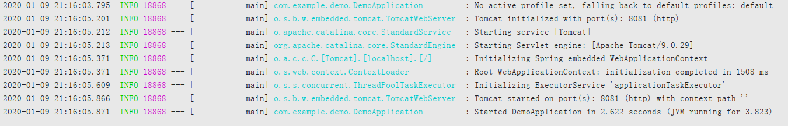

# springboot 学习笔记

## 1、环境准备：

> 开发工具 idea
>
> jdk1.8
>
> mysql 8.0
>
> apache-maven-3.5.4

## 2、使用idea快速创建一个springboot项目

在idea新建一个project，选择Spring Initializr，这样我们就可以直接联网创建一个springboot项目


这里我们都选择默认的，项目基于maven管理，并在打包的时候打包为jar包，项目完成之后可以直接丢到服务器，执行命令 java -jar xxxx.jar就可以把我们的项目跑起来。

点击下一步，springboot会让我们选择我们所需要的依赖，比如下面几个，为了我们项目先运行起来，我们只选择第一个

> Web -> Spring Web: 可以提供Rest服务  
>
> Developer Tools -> Lombok: 这是一个可以省去getter、setter、构造方法、tostring方法等的一个依赖，使用注解就可以实现。
>
> SQL -> MySQL Driver: 我们使用mysql，所以我们这个依赖帮我们提供mysql驱动()
>
> SQL -> MyBatis Framework: 数据库持久层框架

这样，我们就完成了springboot项目的创建。项目结构如下：


- DemoApplication是我们springboot项目的程序入口，由注解@SpringBootApplication标识，我们可以在这里直接运行这个项目

- application.properties文件是进行springboot项目配置的地方，比如配置访问端口、日志、等等都在这里配置

springboot默认支持两种配置文件，一种是我们看到的application.properties，另一种就是application.yml。也就是说我们可以用application.yml来替换这个文件。我们删掉application.properties，新建application.yml文件。

文件建好后，我们进行第一个配置，配置我们rest的访问端口为8081（默认为8080）


## 3、编写第一个rest接口 helloworld

1、创建controller类

在生成的代码路径下新建controller包，然后再controller包下新建我们的第一个Controller类FirstController.java

@RestController标识是一个rest服务类，@RequestMapping指定访问路径

```java
package com.example.demo.controller;

import org.springframework.web.bind.annotation.RequestMapping;
import org.springframework.web.bind.annotation.RestController;

@RestController
public class FirstController {
    @RequestMapping("helloworld")
    public String helloworld() {
        return "helloworld";
    }
}
```
创建完成后我们回到DemoApplication入口类点击运行，项目启动成功如下：



然后我们访问我们的第一个helloworld接口，打开浏览器访问 http://localhost:8081/helloworld


